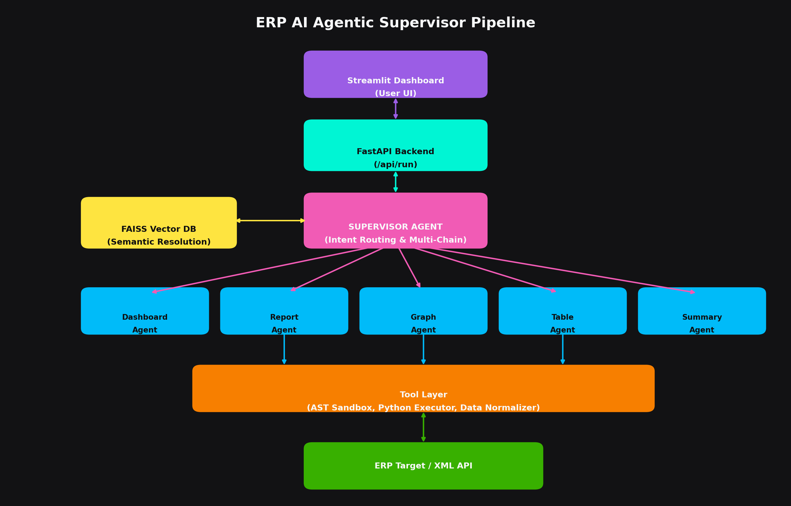

# ASCENSION LOG — Autonomous Multi-Agent Supervisor System
> 30 days. One project. Real impact.
> Built from scratch. Deployed on AWS. No shortcuts.
## The Goal
A production-grade LangGraph multi-agent system where a supervisor agent 
autonomously decomposes tasks and routes them to specialized workers — 
callable via API, deployed on AWS, battle-tested with real use cases.
## The Rule
Every session = a commit. Every day = an entry. 
No zero days.

## Day 1 - Gemini API Debugging [1 JULY]
- Set up `Learning/day1_llm_call.py` to call Gemini from Python.
- Learned that the correct import is `import google.genai as genai`, and the `google-genai` package must be installed in the active `.venv`.
- Verified `.env` loading from the script folder so the key is read from `Learning/.env`.
- Reached the API, but Google returned `401 UNAUTHENTICATED`, so the remaining issue is the credential type, not the Python syntax.
## Day 2 — July 2, 2026
**What I built:**
- Dynamic prompt templates using ChatPromptTemplate
- LangChain pipe operator (prompt | llm)
- Handled response.content edge cases for thinking models
- Switched to gemini-3.5-flash for faster responses

**What I learned:**
- ChatPromptTemplate structures prompts with variables
- The | operator chains components together
- .env path handling relative to file location

## Day 3 — July 3, 2026
> **Quote of the Day:** "Motivation, Pain, Failure is a temporary variable in life. Replace that with hard work it becomes a const variable assigned to Success."
> `const success = hardWork;` — no reassignment possible.
> *— Aashish Kumar Singh*

**What I built:**
- First LangGraph Agent using `create_react_agent`
- Created `@tool` decorated functions for math and mock APIs
- Attached tools to the LLM so it can execute them
- Streamed multi-step reasoning logs to the terminal

**What I learned:**
- Agents can reason about whether to call a tool or answer normally
- LangGraph is the modern framework for orchestrating LLM tool calling
- Tools require good docstrings because that's how the LLM knows when to use them
## Day 4 — July 4, 2026
**What I built:**
- Interactive calculator agent that runs until "calculation done"
- 4 arithmetic tools: add, subtract, multiply, divide
- Agent maintains conversation history across turns
- Handled Gemini rate limits (429 error) — switched models

**What I learned:**
- ReAct loop: Reason → Act → Observe → Reason again
- create_react_agent builds a 3-node graph internally (agent → tool → agent)
- Streaming loop yields each step as it happens
- Free tier limits: gemini-3.5-flash = 20 requests/day
- messages list grows with each turn = agent memory

**Tomorrow's plan:**
- Learn LangGraph state management
- Build first custom graph manually (no create_react_agent shortcut)

> **Quote of the Day:** "Today I didn't bring everything I had. The fire was low, the focus scattered, and I know it. But I showed up anyway — gym done, agent built, quests logged. Some days the grind isn't glorious. This was one of them. I'm writing this so future me remembers: even bad days got done. That's the standard. No zeros, no excuses — just forward."
> *— Aashish Kumar Singh*

## Day 5 — July 5, 2026
**What I built:**
- First custom state graph using LangGraph's `StateGraph`
- Manual workflow with `drafter` and `reviewer` nodes
- Defined a `TypedDict` to pass state (`topic`, `draft`, `review`) between nodes

**What I learned:**
- `StateGraph` requires a typed dictionary to define the state schema.
- Nodes are just Python functions that return a dict to update the state.
- Workflows must be compiled into a runnable application before invoking.

**Tomorrow's plan:**
- Build a Supervisor agent that routes tasks to different workers
- Combine multiple agents into a single graph

> **Quote of the Day:** "Small steps every day. The state graph is the foundation of complex reasoning loops."
> *— Aashish Kumar Singh*

## Day 6 — July 6, 2026
**What I built:**
- Supervisor multi-agent graph in LangGraph.
- Integrated `math_worker` and `writer_worker` nodes.
- Structured routing schema using Pydantic output parsing for routing decisions.
- Cascade worker chaining (`math_worker` -> `writer_worker` -> `END`) to minimize LLM supervisor cycles.

**What I learned:**
- Subclassing `ChatGoogleGenerativeAI` is a safe way to override the `invoke` method for transparent rate-limiting and retry logic, fully compatible with Pydantic v2.
- Direct worker chaining reduces routing calls, dramatically speeding up multi-step tasks.

## Day 7 — July 7, 2026
**What I built:**
- Persistent conversational memory system using LangGraph's `MemorySaver` checkpointer.
- Programmatic multi-turn conversation that retains user state (e.g. name) across distinct execution boundaries.
- Clean message stripping logic that extracts plain text from list/metadata-heavy messages to minimize token usage.

**What I learned:**
- LangGraph's `MemorySaver` preserves the state of the conversation seamlessly by assigning a `thread_id`.
- Stripping thinking metadata, signatures, and extra dictionary formatting from message payload reduces token usage by 90%, preventing resource exhaustion on the free tier.

> **Quote of the Day:** "Optimize the constraints. When API limits push back, smarter routing and cleaner context are the way forward."
> *— Aashish Kumar Singh*
## Day 8 — July 8, 2026
**What I built:**
- Human-in-the-Loop (HITL) safety gating using LangGraph compilation breakpoints.
- Configured graph to pause execution automatically using `interrupt_before=["math_worker"]` prior to entering expensive tool loops.
- Terminal-based approval gateway that reads the graph state snapshot (`app.get_state`), logs the Supervisor's intent, and prompts for manual approval (`y/n`) or corrections before resuming.

**What I learned:**
- Production-grade agents require deterministic boundaries. Breakpoints act as safety gates to prevent runaway LLM execution loops and burning API credits.
- `app.get_state(config)` allows deep state-inspection mid-flight, and passing `None` back into `app.stream()` seamlessly resumes execution exactly where the graph intercepted itself.

**Tomorrow's plan:**
- Dive deeper into dynamic state updates or custom error boundary nodes to gracefully handle sub-agent failures.

> **Quote of the Day:** "The difference between a prototype and production is rigor — breakpoints, persistent state, and predictable boundaries." *— Aashish Kumar Singh*

## Day 9 — July 9, 2026
**What I built:**
- Web summarizer worker using a LangGraph mini-supervisor:
  - `web_worker`: fetches URL HTML, extracts readable text, and produces a web summary.
  - `writer_worker`: rewrites into a final user-facing answer with key points.
- Implemented `fetch_url_text` tool:
  - Cleans noise (`script/style/header/footer/nav`) via BeautifulSoup
  - Normalizes whitespace and truncates large pages to `max_chars`
- Added structured routing for the supervisor:
  - If a URL is detected / user asks to summarize web content => route to `web_worker`

**What I learned:**
- Web summarization becomes reliable when extraction is deterministic first, then summarization.
- Agent routing + tool calling needs clear tool docstrings and strict “no invented facts” prompts.
- Threaded execution (`thread_id`) makes debugging and iteration much easier across runs.

## Day 10 — July 10, 2026
**What I built:**
- Internet research (easy version) worker using a two-stage pipeline:
  - `research_worker`: searches Wikipedia (lightweight “search”), fetches multiple pages, extracts text, and compiles research notes.
  - `writer_worker`: produces a consolidated final summary with key points + sources.
- Implemented `wiki_search` tool using Wikipedia API:
  - Returns `title`, `url`, and `snippet`
- Implemented best-effort extraction in `fetch_url_text` (same approach as Day 9).
- Added a simple research-notes prompt format so the writer step is consistent and less error-prone.

**What I learned:**
- “Easy research” pipelines work surprisingly well when the sources and note format are controlled.
- Splitting research (collect + extract) from writing (synthesize) reduces hallucination risk and improves output stability.
- Even without a true search provider (Tavily/SerpAPI), structured Wikipedia search + fetch can validate the agent architecture quickly.
**What I learned:**
- Merging multiple “mini-pipelines” into one supervisor graph makes it easier to scale routing and reuse extraction logic.
- Keeping worker outputs structured (web summary vs research notes) improves synthesis reliability and reduces hallucination risk.
## Day 11 — July 11, 2026
**What I built:**
- Error handling & graceful failure recovery in agent nodes
- Timeout mechanisms to prevent hanging on slow API calls
- Fallback routing when primary worker fails
- Structured logging for debugging multi-agent flows

**What I learned:**
- Production agents need explicit error boundaries — try/except at node level
- Timeouts prevent runaway costs on free tier (429 rate limits, hanging requests)
- Fallback chains (`primary_worker` → `fallback_worker`) improve reliability
- Logging state snapshots mid-flow simplifies debugging complex agent interactions
> **Quote of the Day:** "Errors aren't bugs. They're signals that the system needs guardrails. Every exception caught is a production lesson learned early."
## Day 12 — July 12, 2026
**What I built:**
- A unified “web research supervisor” that merges Day 9 + Day 10 capabilities into one LangGraph graph:
  - `web_worker`: extracts readable text from a detected URL and produces a 5-key-points summary.
  - `research_worker`: runs lightweight internet research by searching Wikipedia, fetching multiple pages, then generating research notes.
  - `writer_worker`: synthesizes a final user-facing response using worker outputs.
- Implemented a routing supervisor that decides which worker to call based on user text:
  - If a URL is present => `web_worker`
  - If the user asks for research => `research_worker`
  - Always ends in `writer_worker` for final output.

## Day 13 — July 13, 2026
**What I built / debugged:**

- Debugged Day 12 failure mode: vague “Prompts” intent caused irrelevant Wikipedia results (Kepler / thermodynamics / Buddhism).
- Updated Day 13 unified research logic to improve prompt/model behavior:
  - Tightened intent detection so “First Law of Motion” routes to the Newton-first-law quality path.
  - Strengthened the notes prompt constraints to keep outputs strictly on-topic and to emit `[SOURCES UNRELATED / INSUFFICIENT]` when mismatched.
- Replaced a blocked Wikipedia REST approach:
  - Wikipedia REST summary endpoint returned `403 Forbidden` in this environment.
  - Switched to HTML fetching + extraction of the Wikipedia lead section for Newton’s First Law.

**What I learned:**
- Wikipedia “search” for underspecified intent is not reliable; direct page targeting + strict synthesis constraints dramatically reduces off-topic contamination.
- Production-quality agents need both:
  - routing intent fixes, and
  - synthesis prompts that enforce “no cross-domain drift”.
- External API availability (REST vs HTML) must be treated as a first-class reliability concern.

**Testing (critical-path):**
- Ran Day 13 end-to-end for: `Research: Newton's first law of motion (What is it? main concepts?)`
- Verified output stayed aligned with Newton’s First Law (Law of Inertia), not other “first laws”.

## Day 14 — July 16, 2026 (AWS scaffolding)
**What I built:**
- `aws/lambda_handler.py`: API-Gateway compatible Lambda handler that calls the Day 13 LangGraph unified web-research workflow.
- `aws/README.md`: local simulation + env var instructions.

## Day 15 — July 16, 2026 (Basic RAG demo)
**What I built:**
- `Learning/day15_basic_rag_simple_retrieval.py`: runnable RAG demo using lexical/token-overlap retrieval.
- `Learning/day15_basic_rag.py`: embeddings-based RAG (optional; depends on embedding model availability).
- Documentation + notes:
  - `Learning/day15_rag.md`
  - `Learning/day15_rag_no_embeddings_note.md`
  - `Learning/rag_requirements_note.md`

**Testing:**
- Ran `python Learning/day15_basic_rag_simple_retrieval.py` end-to-end and confirmed the output aligns with Newton’s First Law.

