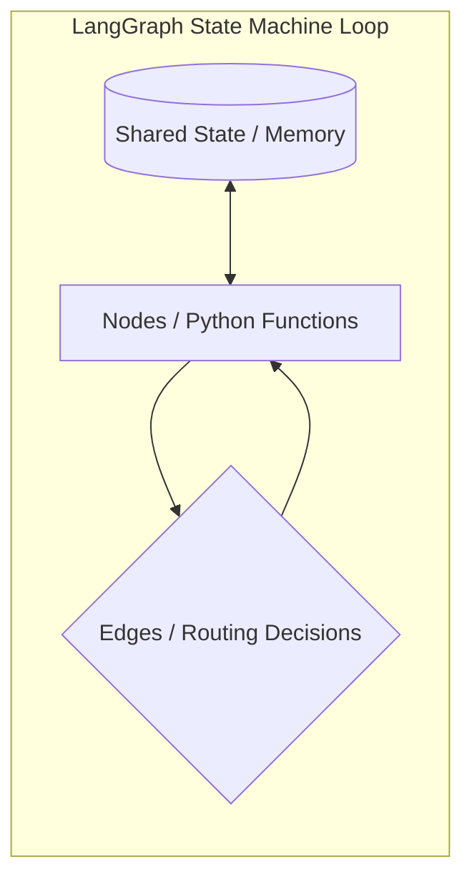
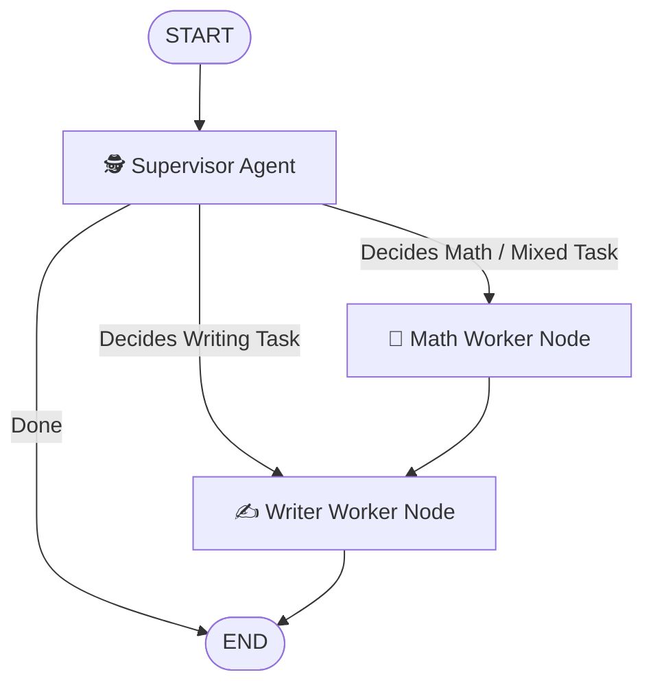

# Autonomous Multi-Agent Supervisor System

A production-grade LangGraph multi-agent system where a supervisor agent autonomously decomposes tasks and routes them to specialized worker agents — built from scratch, deployed on AWS. No shortcuts.

## Current Status
🚀 **Day 7 / 30 Completed**

---

## Architecture: How LangGraph Works

LangGraph is a library for building stateful, multi-actor applications with LLMs, used to orchestrate complex agentic workflows. Under the hood, LangGraph models the agent flow as a state machine:



### Core Concepts

1. **State (`StateGraph`)**:
   - The central source of truth for the entire workflow. It is defined as a typed data structure (e.g., `TypedDict`) passed between nodes.
   - Using **Reducers** (like `add_messages`), the graph specifies how node updates are merged into the state (e.g., appending new assistant responses to conversational history).

2. **Nodes**:
   - Python functions or LangChain runnables that take the current state, perform an action (e.g., LLM invoke, tool call, parsing), and return a dictionary containing the updated fields of the state.

3. **Edges & Conditional Edges**:
   - **Edges** define static step-by-step routing (e.g., `START -> supervisor`).
   - **Conditional Edges** use decision-making functions (often powered by a structured LLM output) to select the next node dynamically based on the current state.

4. **Persistence (Checkpointers)**:
   - Save points (`MemorySaver`) that automatically store snapshots of the state after each node execution, keyed by a `thread_id`. This allows the agent to maintain multi-turn context (conversational memory) over separate invocation requests.

---

## Supervisor Agent Architecture (Days 6 & 7)

Our implementation uses a **Supervisor Pattern** to delegate tasks to specialized workers. To minimize LLM calls and token consumption, the workers are chained in a linear cascade pipeline:




1. **Supervisor Agent**: Inspects the user prompt and decides the entry node (`math_worker` or `writer_worker`) using a structured Pydantic schema.
2. **Math Worker**: Performs complex calculations using single-pass reasoning prompts (replacing heavy ReAct loops to save 75% token volume), then cascades directly to the `writer_worker` to explain/format the numbers.
3. **Writer Worker**: Compiles calculations, adds styling, and outputs a refined response before routing directly to `END`.

---

## Build Progress

See [ASCENSION_LOG(Devlog).md](./ASCENSION_LOG(Devlog).md) for the detailed daily log.

| Day | Feature | Key Learning |
|-----|---------|--------------|
| **Day 1** | First LLM Call | Standard Gemini SDK config & `.env` handling |
| **Day 2** | Prompt Templates | Piping prompt templates & handling thinking tokens |
| **Day 3** | LangGraph ReAct | Dynamic tool binding using `@tool` and `create_react_agent` |
| **Day 4** | Conversation History | Streaming message history to sustain agent turn-memory |
| **Day 5** | Custom StateGraph | Building manual graphs with distinct nodes (`drafter` & `reviewer`) |
| **Day 6** | Supervisor Agent | Structured routing and direct worker cascading to save LLM calls |
| **Day 7** | Persistent Memory | Thread-level state recovery using `MemorySaver` checkpointer |

---

## Tech Stack
- **Framework:** LangChain, LangGraph
- **LLM:** Google Gemini (`gemini-2.5-flash` / `gemini-3.5-flash`)
- **Cloud:** AWS (upcoming — Lambda, S3, DynamoDB)
- **Language:** Python 3.9+

---

## Project Structure
- `Learning/day1_llm_call.py` — first LLM call via LangChain
- `Learning/day2_prompt_template.py` — dynamic prompt templates
- `Learning/day3_tools_and_agents.py` — tool calling and react agents using LangGraph
- `Learning/day4_interative_agent.py` — interactive calculator agent
- `Learning/day5_manual_state_graph.py` — manual custom graph
- `Learning/day6_supervisor_agent.py` — optimized supervisor multi-agent graph
- `Learning/day7_persistent_memory.py` — multi-turn supervisor agent with memory checkpointer
- `ASCENSION_LOG(Devlog).md` — daily entry log
- `Learning/.env` — local API key configuration

---

## Setup & Running

1. **Virtual Environment & Dependencies**:
   ```bash
   python3 -m venv .venv
   source .venv/bin/activate
   pip install langchain langchain-google-genai langgraph python-dotenv pydantic
   ```

2. **Set Environment Variables** in `Learning/.env`:
   ```env
   GEMINI_API_KEY=your_gemini_api_key
   ```

3. **Run Day 6 Supervisor Agent**:
   ```bash
   python Learning/day6_supervisor_agent.py
   ```

4. **Run Day 7 Persistent Memory Test**:
   ```bash
   python Learning/day7_persistent_memory.py
   ```